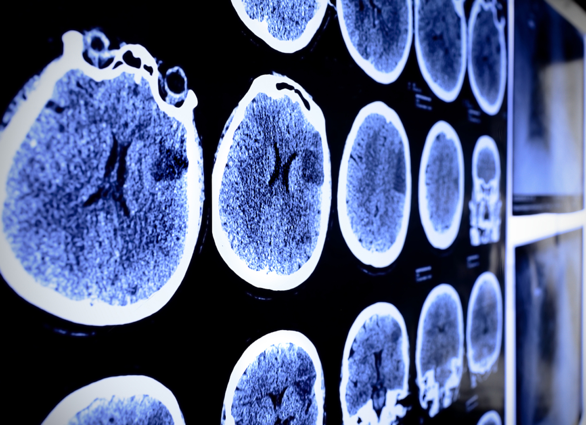

# Deep Learning Case Study: Model Building and Network Comparison

## Brain_Tumor_Classification

    

- The data set Obtained from kaggle
  
- Develop a Neural Network model aimed at the classification of whether a patient has a brain tumor or not based on the analysis of brain MRI scans.

- Developed 3 Deep Neural Network models i.e. DenseNet(Densely Connected Convolutional Networks), ReseNet50,Xception in order to classify the Brain MRI Images to 4 different independent classes.
  
- Statistical metrics was used to evaluate model performance.
  
- See the Metrics in a table below: Accuracy,F1-score, MAE; MSE, RMSE

